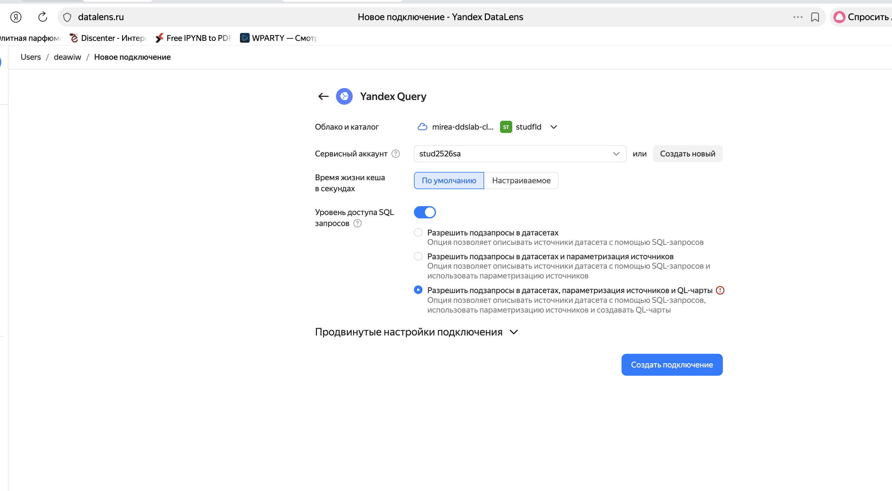
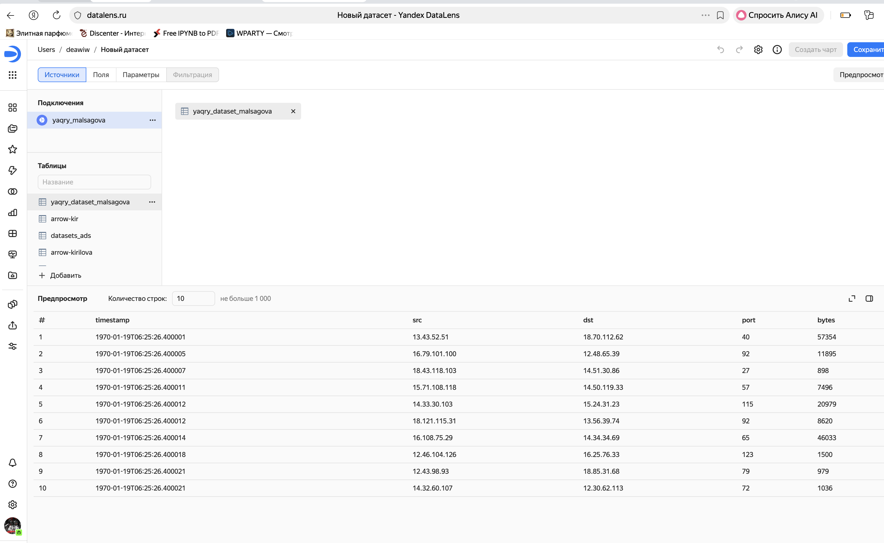
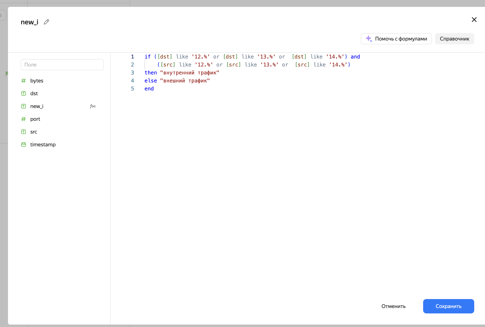
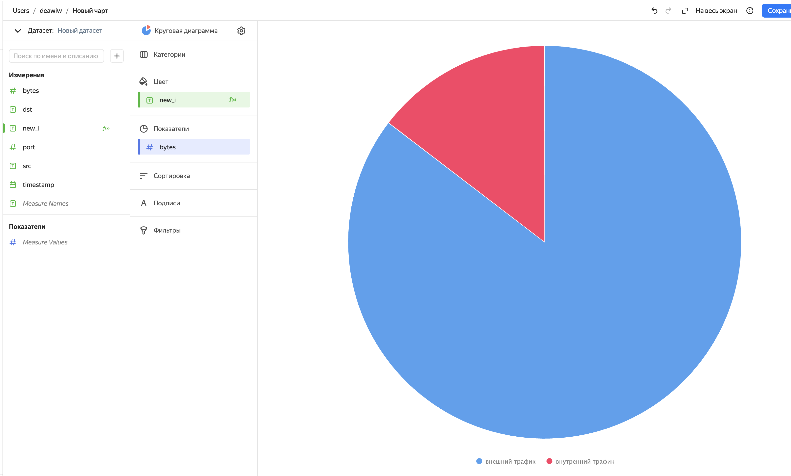
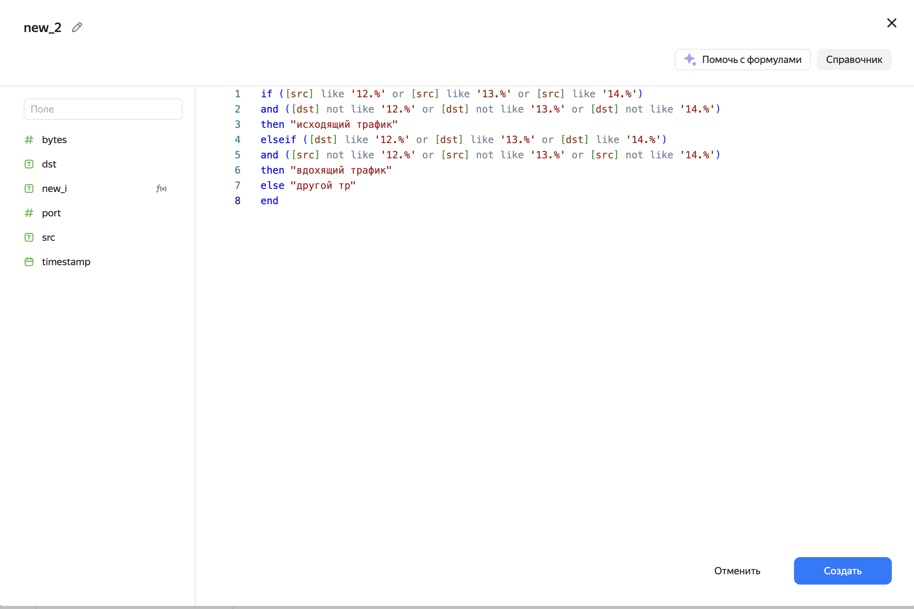
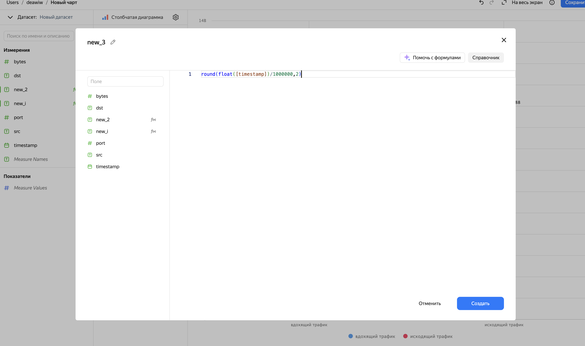
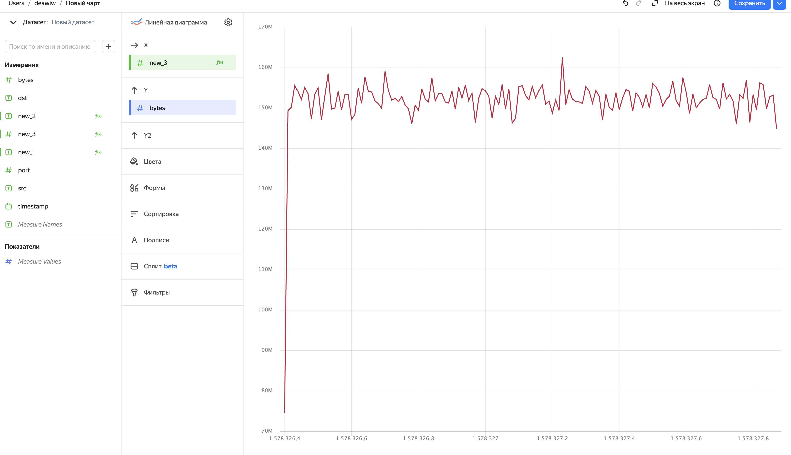
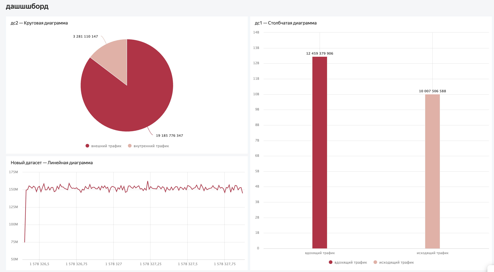

# Практическая работа 8
deawiw@yandex.ru

## Цель работы

1.  Изучить возможности технологии Yandex Query для анализа
    структурированных наборов данных
2.  Получить навыки построения аналитического пайплайна для анализа
    данных с помощью сервисов Yandex Cloud
3.  Закрепить практические навыки использования SQL для анализа данных
    сетевой активности в сегментированной корпоративной сети

## Исходные данные

1.  Программное обеспечение macOS 14.0
2.  RStudio Desktop
3.  Интерпретатор языка R 4.1

## План

1.  Настроить подключение к Yandex Query из DataLens.
2.  Создать из запроса YandexQuery датасет DataLens.
3.  Делаем нужные графики и диаграммы.
4.  Составляем дашборд.

## Шаги:

1.  Настройка подключения DataLense Создание подключения
    

2.  Создание датасета в DataLense 

3.  Создание графиков

Создание круговой диаграммы 

Создание столбчатой диаграммы 

Создание линейного графика  

1.  Создание дашборда  [Ссылка на итоговый
    дашборд](https://datalens.ru/4oi9aq09qt90o-dashshshbord)

## Оценка результата и вывод

Настроели DataLens, создали датасеты и визуализации для анализа сетевого
трафика, использовали SQL-запросы для классификации трафика

## Вывод

Освоили Yandex DataLens для визуализации сетевой активности, создали
дашборды для наглядности анализа трафика
